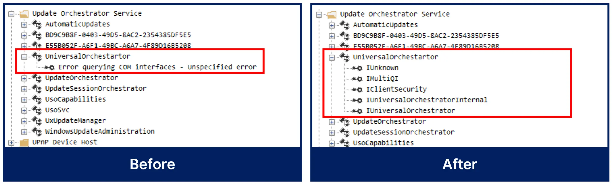

  <h1><code>oleviewdotnet
(BoB13-MSRC_GASAN)</code></h1>
  

    <strong>Enhanced oleviewdotnet</strong> 
    show more interfaces, resolve IDL method name, provide interface object call sequence
  

  

    Derived from <a href="https://github.com/tyranid/oleviewdotnet">oleviewdotnet</a> of tyranid(James Forshaw)
  

  

    <video controls>
      <source src='pics/demo_oleviewdotnet.webm' type="video/webm" />
    </video>
  

## Overview
The existing oleviewdotnet has a problem where the method name appears as `Proc{n}` in the IDL because the symbol loading function does not work.

Also, there is a problem where the corresponding interface is not output for certain classes.

This repository has improved this part and added convenient features such as providing interface object call sequence.

---

## Improvements
### Solve the problem of interface not being extracted

- For classes that are empty because the interface is not extracted or that only output IUnknown, **the interface is identified and extracted.**
- It iterates through the IIDs registered in the registry for the CLSID of the class to be extracted and performs CoCreateInstance. If successful, it is judged to be correct and the interface is extracted through the IID.

### IDL Method Name Resolve

- **To use this feature, you need to enable "Resolve Method Name by IDA" in the Processes tab.**
- This feature is implemented leveraging the IDA decompile engine.
- The path to the binary is displayed at the top of the IDL.
- If you see `// Candidate {n}` in your IDL, it may not be accurate because it is a guess based on the number of methods and the number of arguments.
- Since we use IDA to extract method names, you must have run ida64.exe at least once to register the IDA path in the registry.
- **The first time DLL copy and analysis process using idat64.exe may take some time.**
### IDL Method Name Resolve (HARD)
- **It decompiles all dlls loaded into the process.**
- Even if the interface belongs to example.dll but is actually implemented in example_core.dll or example_impl.dll, etc. and loaded into the process and operated, method name resolution is possible.
### IDL Method Name Resolve (Fix mode)
- You can perform method name resolution quickly **by specifying a dll**, rather than decompiling all dlls every time.

---

## Additional features
### Interface object Call Sequence

- **Lists all sequence of other interface objects that can be obtained from an exposed COM interface.**
- You can obtain various interface objects from exposed COM interfaces, such as IWallet->IWalletItemManager->IWalletItemList->IWalletItem, and understanding them is deep and complex.
- From a vulnerability research perspective, it easily identifies the scope of interface objects that can be accessed and analyzed.
---

## Achievement
- We can extract more 91 methods.
- We can automatically find the vtable of an interface and resolve IDL method names with high accuracy.
- We can easily determine the target scope of the COM interface
- As a result, a dramatic reduction in the initial analysis time for vulnerability analysis is possible.
